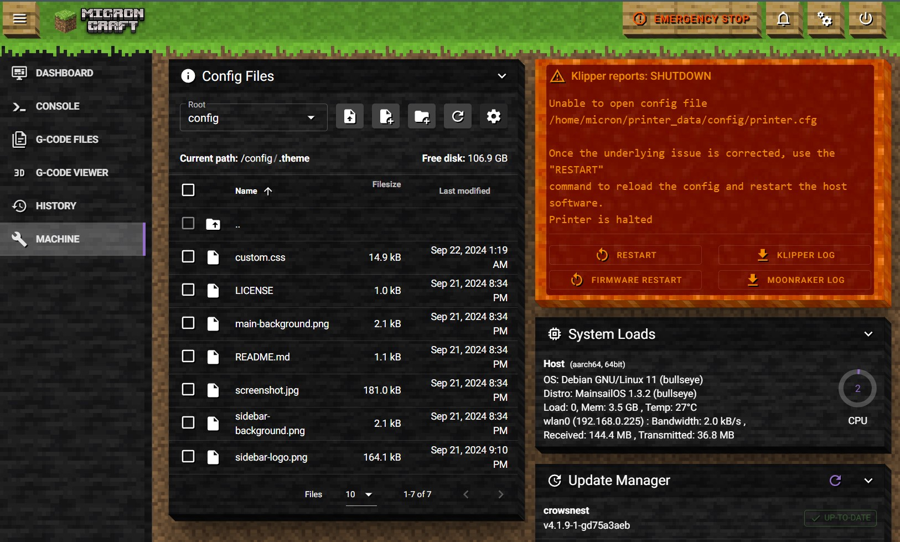

   
  Minesail is a simple Minecraft theme for <a href="https://docs.mainsail.xyz">Mainsail</a>.

## Setup
Create a ".theme" folder inside your Klipper config folder and upload the files from this repository directly to this folder. You can do all this [from within Mainsail](https://docs.mainsail.xyz/features/theming/prepare).

__Please be aware,__ that this theme hides the printer name. I use a generated logo that has printer name.

## Your own Minecraft logo / printer name
To create your own Minecraft style logo, the best way is to use [this generator](https://www.textstudio.co/logo/minecraft-3d-text-41). Make sure that you uncheck the background and set the aspect ratio to "square".

Save the file as "sidebar-logo.png" and replace the one in the ".theme" folder.

## Screenshot

---

  

